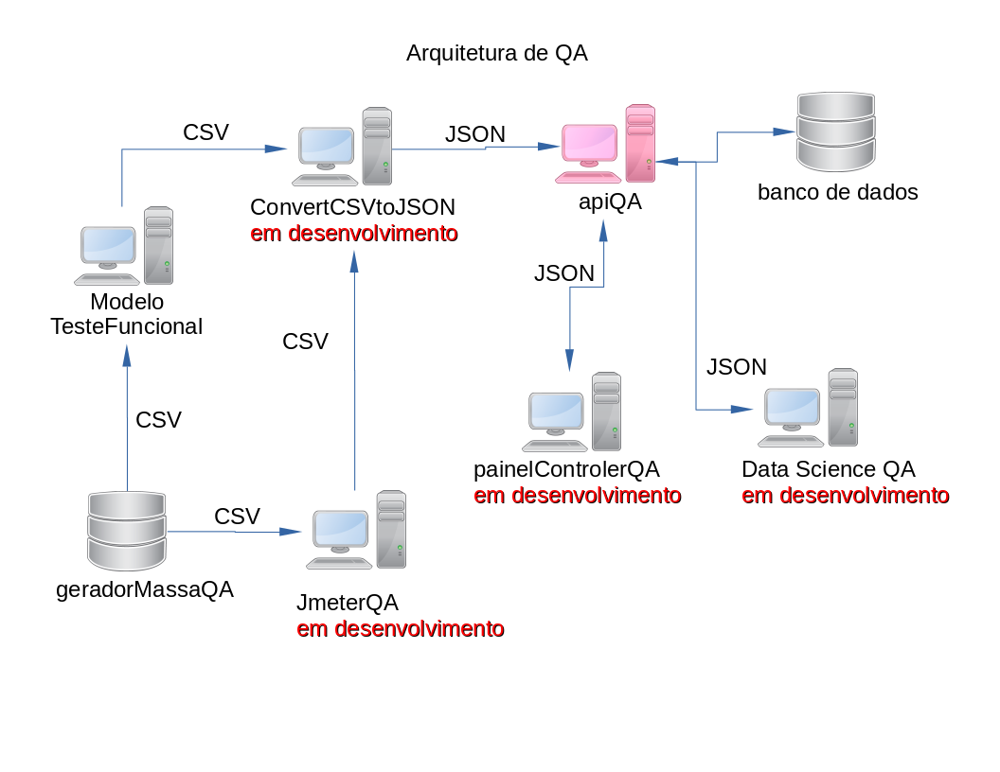

# apiQA

> 	Painel Teste, faz parte de um projeto de arquitetura de QA.
> 	Versão 04

> __Mais informacoes sobre a Arquitetura QA__

>		Email = marcosregato01@gmail.com
>		Assunto = Arquitetura QA

> __Descricao do projeto__

>		Recebe as informações (formato JSON) dos resultados dos teste e envia para o banco de dados (MongoDB)

> ** Ferramentas de desenvolvimento **  
> * Java - versão 8
> * Spring boot - versão 2.3.0
> * REST
> * Conexao com MongoDB  

# Erro quando roda API

> 	Verify the connector's configuration, identify and stop any process that's listening on port 8080, or configure this application to listen on another port. 
> 	(Verifique a configuração do conector, identifique e pare qualquer processo que esteja escutando na porta 8080 ou configure este aplicativo para escutar em outra porta.)

> __Solucão do erro__  
> 	sudo kill -9 $(lsof -i :8080)   

# URL para acessar API
> Acesse http://localhost:8080/api/clientes

# Links dos projetos da arquitetura

> __Modelo Teste Funcional__
> [GitHub Pages](https://github.com/marcosregato/modeloTesteFuncional). 

> __Painel Teste Angular__
> 	[GitHub Pages](https://github.com/marcosregato/painelTesteAngular). 

> __Api QA__
> [GitHub Pages](https://github.com/marcosregato/apiTesteMongoDB). 

> __convert CSV to JSON__
> [GitHub Pages](https://github.com/marcosregato/convertCSVtoJSON). 

> __Data Science QA__
> [GitHub Pages](https://github.com/marcosregato/dataScienceQA). 

> __Teste Api QA__
> [GitHub Pages](https://github.com/marcosregato/testeApiQA). 

> __Gerador massa de dados QA__
> [GitHub Pages](https://github.com/marcosregato/geradorMassaQA). 

# apiQA
